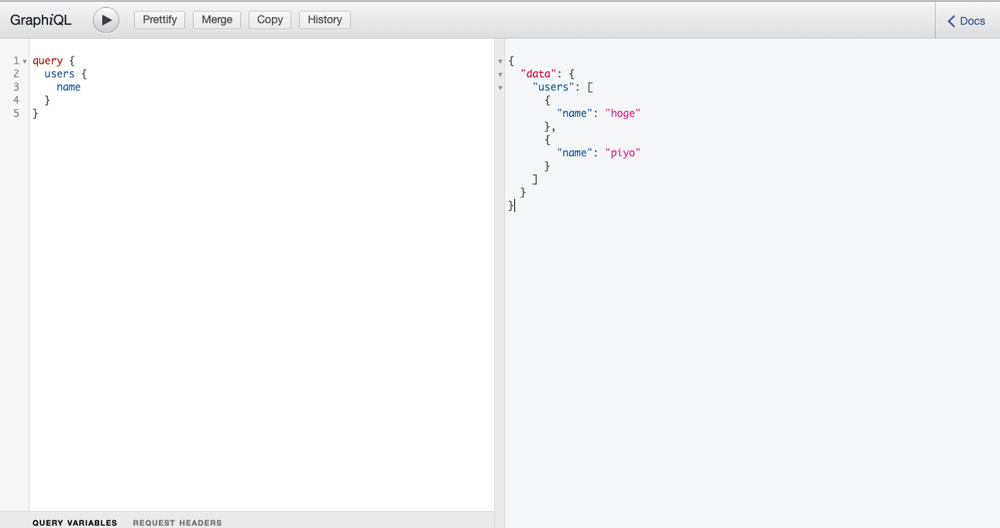

# Graphene-Django-Sample



## memo

```
sqlite> insert into ingredients_usermodel(name,last_name)  values('hoge','fuga');
sqlite> insert into ingredients_usermodel(name,last_name)  values('piyo','gaoh');
```
